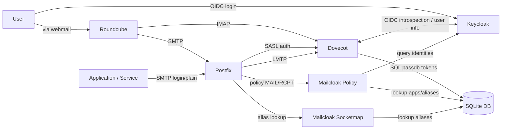

# mailcloak

Mailcloak is a Postfix policy service designed to secure and control mail flows by integrating Postfix, Dovecot, and an identity provider (IdP) such as Keycloak.

It enables fine-grained authorization of mail senders and recipients based on identities managed in your IdP, while remaining compatible with standard SMTP workflows. Mailcloak is particularly suited for small modern mail infrastructures relying on OIDC authentication.

## Why Mailcloak?

Mailcloak was born out of a practical limitation: I found no existing solution that could natively combine Keycloak identity management, while providing fine-grained mail authorization. I didn't want users could spoof other users' email addresses, nor maintain separate postfix/dovecot files (and thus have to synchronize them continuously).

My goal was to build a mail system where:

- **Keycloak is the single source of truth for users**
- Users authenticate to webmail (e.g. Roundcube for me) using **OIDC**
- Postfix and Dovecot can **actively enforce sender and recipient policies**
  based on the authenticated identity
- A small number of applications can still send mail using **standard SMTP
  authentication**, with easily renewable token credentials

## Features

- 🔐 **OIDC-based identity enforcement**
  - Users are authenticated via Dovecot using OIDC (Keycloak)
  - Postfix authorization decisions are aligned with the authenticated identity

- 📬 **Sender and recipient validation**
  - Validate both MAIL FROM and RCPT TO against Keycloak identities
  - Support for user mail addresses and aliases

- 🧩 **Application SMTP access**
  - Local database for SMTP applications
  - Standard `LOGIN` / `PLAIN` authentication for applications and services
  - Per-application enable/disable control

- 👥 **Future-ready group handling**
  - Planned support for Keycloak groups as mail distribution lists

## What it does
- **Policy service** (Postfix policy delegation):
  - `RCPT` stage: accepts if the recipient exists in Keycloak (primary email) or as a local alias in SQLite.
  - `MAIL` stage (authenticated submissions): accepts only if the sender is the user’s primary Keycloak email or one of their aliases.
  When `smtpd_delay_reject = yes`(which is the default), `MAIL` isn't checked separately; so both checks actually occur during the `RCPT` stage.
- **Socketmap service**: exposes an `alias` map to Postfix, rewriting alias -> `username@domain`.
- **SQLite apps database**: stores application SMTP data, including credentials used by Dovecot.



## Project layout
- `cmd/mailcloak/` – main package entrypoint
- `internal/mailcloak/` – daemon sources
- `go.mod` / `go.sum` – Go module files
- `docs/configs/config.yaml.sample` – sample config to copy to `/etc/mailcloak/config.yaml`
- `docs/configs/openrc-mailcloak` – OpenRC service file
- `docs/configs/postfix-main.cf` – Postfix config snippet
- `docs/configs/dovecot.conf` – Dovecot config snippet
- `mailcloakctl` – Python CLI helper to manage database

## Build the binary
From the repository root:

```bash
make build
```

To install system-wide:

```bash
make install
```

To run locally:

```bash
make run
```

## Configuration
Sample configuration can be found in `docs/configs/` folder.

Copy the sample config in `/etc/mailcloak/config.yaml` and edit it according to your environment.

Key settings:
- `idp.provider` selects the identity provider (`keycloak` or `authentik`).
- `idp.keycloak.*` must point to your Keycloak realm and a client with permission to query users.
- `idp.authentik.*` must point to your Authentik base URL and an API token.
- `policy.domain` is the email domain enforced by the policy.
- `sqlite.path` is the aliases database path.
- `sockets.*` must be under the Postfix chroot (usually `/var/spool/postfix`).

## Mailcloak database

### Initialization
**The SQLite database must be initialized before use.** You can use the provided helper script:
```bash
./mailcloakctl init
```

If your database is stored elsewhere, specify the path using the `--db` option:
```bash
./mailcloakctl --db /path/to/mailcloak.db init
```
This is also valid for all other commands for `mailcloakctl`.

### Aliases
You can manage aliases using the helper script:

```bash
./mailcloakctl aliases add alias@example.com username
./mailcloakctl aliases list
```

### Apps (Dovecot app passwords)
The helper script also manages application credentials. The application password is a token: updating the application ID and password is handled by the script and stored as a hash in SQLite. Dovecot can verify these credentials using plain authentication against the stored hash. Applications are restricted to sending emails only (they cannot receive them) and may use only their authorized sender addresses.
As a side note, Dovecot needs to be able to read the SQLite database to authenticate applications.

Examples:

```bash
./mailcloakctl apps add my-app-id "my-app-token"
./mailcloakctl apps allow my-app-id sender@example.com
./mailcloakctl apps list
./mailcloakctl apps disallow my-app-id sender@example.com
./mailcloakctl apps del my-app-id
```

## Postfix integration (example)
Policy service (smtpd_recipient_restrictions):
```
check_policy_service unix:private/mailcloak-policy
```

Socketmap (virtual_alias_maps):
```
socketmap:unix:private/mailcloak-socketmap:alias
```

## OpenRC
Use the provided service file to run Mailcloak as a service with OpenRC (e.g. Alpine Linux):

```bash
cp docs/configs/openrc-mailcloak /etc/init.d/mailcloak
rc-update add mailcloak default
rc-service mailcloak start
```

## Notes
- If the IdP is unavailable, the policy returns `451` by default (configurable via `policy.idp_failure_mode`).
- The policy caches lookups for `idp.<provider>.cache_ttl_seconds`.
